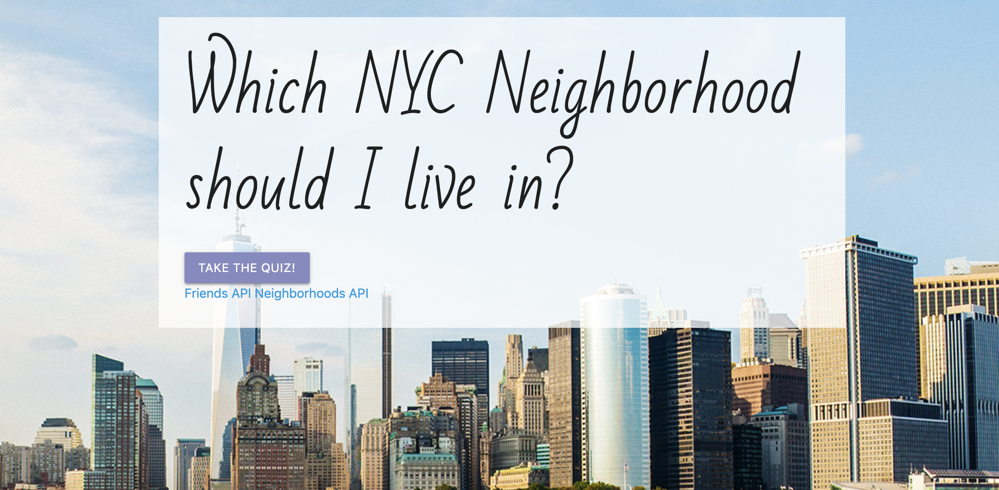
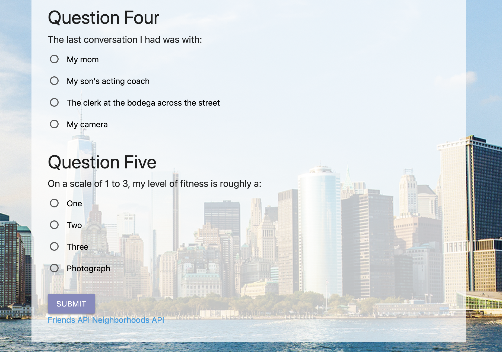
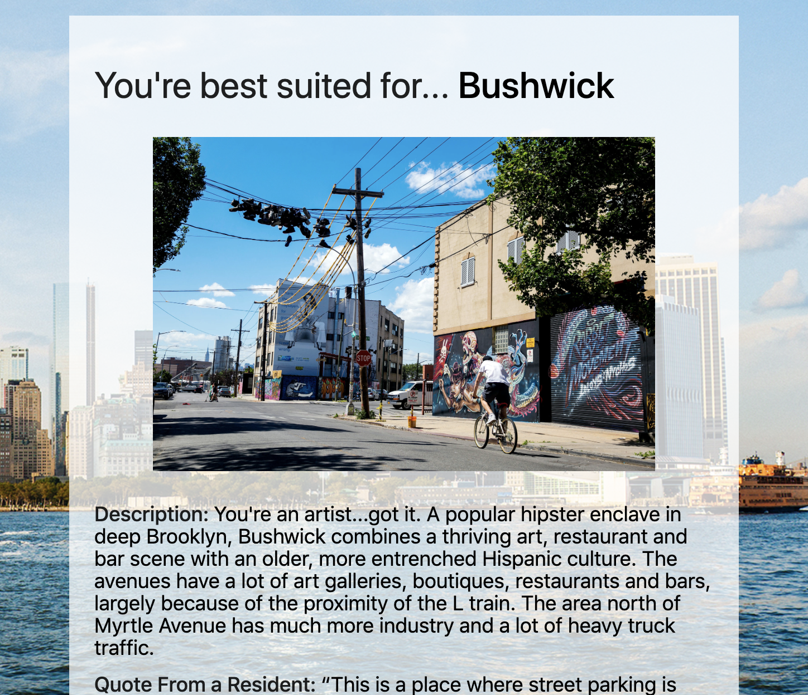

# 'Friend'ly Neighborhood App

Live Link: https://limitless-savannah-87795.herokuapp.com/

# Summary

This 'Friend'ly Neighborhood App helps prospective NYC'ers wade through the chaos that is finding a new apartment in the city by suggesting a neighborhood that suits them, based on a handful of questions they provide answers for. 

The app is designed to direct users from a landing/home page to a survey of multiple-choice questions. Once the user has completed the survey, the app compares the answers provided with the neighborhood information it has stored on the back-end and displays to the user the best match. It can even show a user other Friends living in their new 'hood!

## Technology

The 'Friend'ly Neighborhood App is a full-stack web application built with Javascript, jQuery, CSS, Materialize, and HTML on the front-end, and Node and Express on the back-end. 

The quiz itself works by grabbing form values users provide on the questionnaire, and pushing those answers to the surver via a POST request. Those answers are then run through a comparison algorithm on the back-end to find the neighborhood most similar to the user's reseponses, and sending the matching neighborhood object back to the client, where it's name, description, and photo are then displayed on the page.

### Images

#### Survey Page:

Isn't she breathtaking?!

#### Neighborhood Display:

## Current State
The app is fully functional but could benefit from some additional CSS styling. The 'Other Friends' button currently just redirects to all the friends' objects, and needs to be built out in the future.

## License
[MIT](https://choosealicense.com/licenses/mit/)
